<div align="center">
	<div style="padding:10px">
		<a href="https://rematrix.remohexa.com" target="_blank"></a>
	</div>
	<h3>A local, self contained media network running entirely on wifi hotspot by taking advantage of captive portals</h3>
</div>

<div align="center">
<table>
<tr>
<td colspan="4" align="center"><a href="repostuff/assets/screenshots/gifs/captive.gif">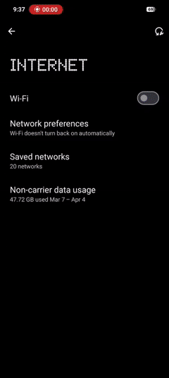</a></td>
</tr>
<tr>
<td><a href="repostuff/assets/screenshots/images/index.webp">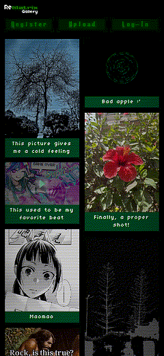</a></td>
<td><a href="repostuff/assets/screenshots/images/register-page.png">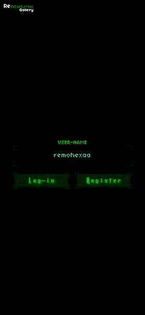</a></td>
<td><a href="repostuff/assets/screenshots/images/login-page.png">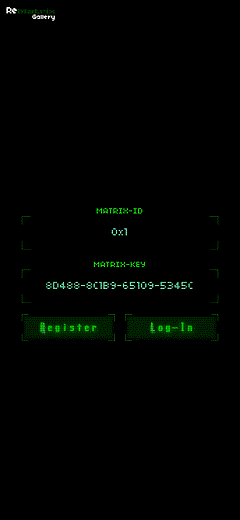</a></td>
<td><a href="repostuff/assets/screenshots/images/user-page.webp">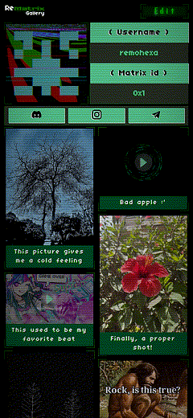</a></td>
</tr>
<tr>
<td><a href="repostuff/assets/screenshots/images/user-edit.webp">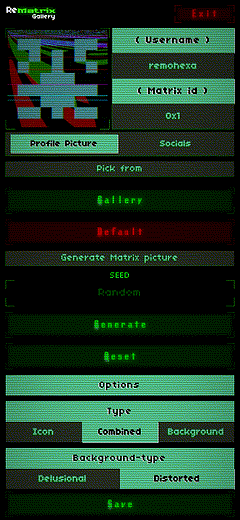</a></td>
<td><a href="repostuff/assets/screenshots/images/upload-page.webp">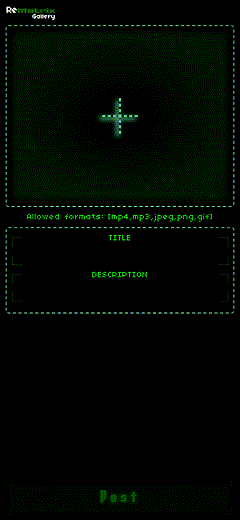</a></td>
<td><a href="repostuff/assets/screenshots/gifs/post-page-audio.gif">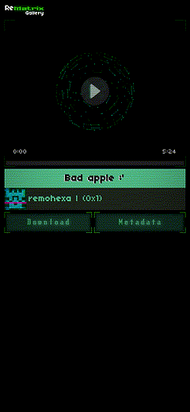</a></td>
<td><a href="repostuff/assets/screenshots/images/post-page-normal.webp">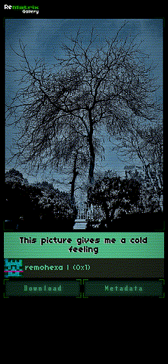</a></td>
</tr>
<tr>
<td><a href="repostuff/assets/screenshots/images/post-page-deleted.png">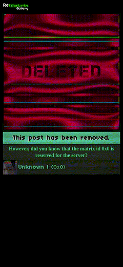</a></td>
<td><a href="repostuff/assets/screenshots/images/post-page-404.png">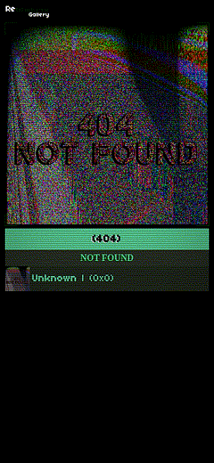</a></td>
<td><a href="repostuff/assets/screenshots/images/post-page-metadata.webp">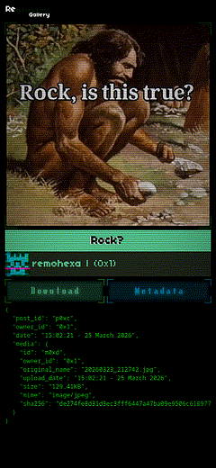</a></td>
<td><a href="repostuff/assets/screenshots/images/user-edit-socials.webp">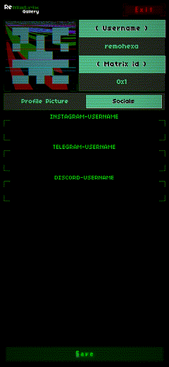</a></td>
</tr>
</table>
<sub>Click any picture to open higher resolution versions [Not animated]</sub>
</div>
<br>

<div align="center">

**[Live preview](https://rematrix.remohexa.com) (To get the full experience, consider [full hosting](#quick-start)).**

</div>

### Rematrix Gallery is an idea I had

> What if there was a cool looking website that runs entirely on a local network (wifi hotspot).
>
> Where users can share their artwork, videos, and music with people around them using nothing but their media? Not having to give their names, emails, not even setting up a password.
>
> But they still have an account, so they can delete their media or retrieve it later.

And so, it took me about 8 months to build this.

Despite my prior experience with python and building UIs for android applications, this was my first time working with FastApi, as well as my first time writing html, css and js.

And I chose a fully vanilla website because I wanted it to run on anything that can open a browser.

If you're looking to try it out, feel free to jump into the [Quick start](#quick-start) section.

Anyway, here's the table of contents:

## Contents

- [**Overview**](#overview)
- [**Features**](#features)
- [**Backend**](#backend)
  - [The captive portal](#the-captive-portal)
  - [Internal Logic](#internal-logic)
  - [Deterministic picture generator (repattern)](#deterministic-picture-generator-repattern)
  - [API Endpoints](#api-endpoints)
- [**Frontend**](#frontend)
- [**Media Player Visualizer**](#media-player-visualizer)
- [**Quick start**](#quick-start)
  - [Captive Portal](#pi-zero-2w---captive-portal)
    - [SSH access](#ssh-access)
  - [Standard LAN hosting](#standard-lan-hosting)
    - [Linux](#linux)
    - [Windows](#windows)
- [**Usage & Hosting**](#usage--hosting)
  - [**Serving configuration**](#serving-configuration)
  - [**Captive portal mode**](#captive-portal-mode)
  - [**Lan Hosting**](#lan-hosting)
- [**Known issues**](#known-issues)
- [**Contributing**](#contributing)
- [**Credits & Licensing**](#credits--licensing)

## Overview

The main idea was to build a website that actually looks unique, which is why I went with a modern matrix theme.

But it wasn't just about how it looks. Sure I wanted to make a great looking UI, but also the whole point was to run it locally on something like a raspberry pi, And have it create a wifi hotspot with a name that attracts people, and once they connect, they get redirected straight to the website through a captive portal.

From there, they'll find themselves on the home page, which is basically a feed of what other users have posted, and can just start exploring the website.

That's pretty much the core of it "a small and self contained website without an internet connection" that people can randomly discover and interact with just by connecting to a wifi network. Which perhaps would make it feel like a unique experience that can't really be replicated once the host is gone.

## Features

### Deterministic profile picture generator:

Another project I worked on a long time ago. The idea was to make something like what GitHub generates for new users profile pictures.

But it didn't stay that simple. It went from a basic identicon into something more, with modifiers like:
deterministically generated backgrounds ["delusional", "distorted"], a cyber core, early internet, pixelation effects.

Everything is tied to the user id, so the same id always gives the same result.

Still didn't publish it as a separate repo or give it a proper name yet, but it lives under utils/genbackico.py if you wanna check it out.
For quick output review though, take a look [**here**](#deterministic-picture-generator)

### Auth model:

Doesn't require an email address nor a password.

On registering, a Matrix-id and Matrix-key are generated.
The key gets one way hashed with a salt before going into the DB.

After picking an available username, the user is shown their Matrix-id and Matrix-key.
They see it once, and they can't retrieve their credentials later or reset their key.

Ids are incremental hex starting from 0.
On first run, "0" (0x0) is taken by the server and used for deleted media/posts.

Session is handled using signed JWT inside JWE, stored in an http only cookie.
Logging out requires sending a logout request to the api.

Each user also gets a matrix profile picture generated from their hex id as a seed.

### Media handling:

By default, duplicated uploads aren't allowed, but that can be changed from the server config.

When a user selects a file:
the client sends its hash first, and the server replies whether it's available or not.

If they uploaded it before but didn't post it yet, it'll be happily added to the upload page.
If someone else already uploaded it, they'll see a message that says "This file has already been posted".
If they already posted it themselves, they get redirected to the post page.

If it's available and they proceed:
the file is uploaded and checked again from the server for its sha256 hash.

The type is validated by inspecting the file bytes, not the extension.
If it passes, it gets assigned a path, media_id, and its uploader matrix-id.

Images are cached and served in lower resolution by default.
Full resolution is only returned when explicitly requested (like downloading).

## Backend

### The captive portal

Have you ever asked yourself how your phone shows you that login page upon connecting to a public wifi? Well, I did.

Turns out it's pretty simple. For example:

Android phones send a GET request to this exact url `connectivitycheck.gstatic.com` followed by `/gen_204` or `/generate_204`, and it expects a specific response from that request, which is `204 No Content` as the response status code.

If that wifi you just connected to has an active internet connection, then this request will reach the google page which will respond with `204 No Content`. In this case, your phone will know that this connection has internet.

However, if it couldn't reach that url. It means there's no internet, and you'll see that popup that says 'No internet connection'.

But what if that page replied with something other than `204`? Maybe `302 Found`? In this case your phone will know something else.

Hey, I found that page, this means there should be some sort of 'auth mechanism' and shows you a popup that says 'Sign in to WI-FI network [SSID NAME]'. And some phones would just open that page in webview without you even asking for it.

Anyway, After pressing that popup your phone will open `connectivitycheck.gstatic.com/gen_204` in full view to let you interact with that wifi login page. But in fact, It doesn't have to be one! you can put whatever there, It really doesn't matter.

As long as your phone always gets `302 Found` because it's actually always pinging that url, it'll think that you have to sign in and will always show you that popup and let you do the signing process (or at least what it thinks you'll do inside).

That whole idea, is literally what all the routers use, even the ones that don't have that form of signing in and just wanna show you the admin panel for some cases.

Apple uses a different url and expects a different form of reply for each case and even iOS is differ form macOS, but all of them follow the same concept. The real website replied to me? there's internet, we didn't get any reply? No internet. We got something else? We might need to prompt the user to sign in to that network for the internet to work.

E.g.

```
Android: connectivitycheck.gstatic.com/generate_204 Or clients3.google.com/generate_204
iOS/macOS: captive.apple.com/hotspot-detect.html Or www.apple.com/library/test/success.html
Windows: www.msftconnecttest.com/connecttest.txt Or www.msftncsi.com/ncsi.txt

```

All of them are actually either looking for some specific piece of text in the response body to confirm the connection, or expecting the `302 Found` response code to prompt you the captive portal.

The only missing piece, that page doesn't have to be the one controlling the auth flow. It might send a `Location: http://where-to` with the reponse code of `302 Found` to let the OS prompt you with the sign page, after the sign page actually opens inside a real browser. You'll automatically be redirected to `http://where-to` where you can actually sign in.

ANYWAY, back to the tech rant.

So, all of this was just some kind of information, right? How do we actually do any of it? In our case, We need to always send `302 Found` when any url of these gets any requests right?

If you take a look inside of [rematrix_api.py] after the 'Captive portal' portal comment, you'll find that I just made a normal sounding routes for [`/gen_204`,`/generate_204`,`/hotspot-detect.html`,`/library/test/success.html`,`/connecttest.txt`,`/ncsi.txt`,`/redirect`].

> These are all of the routes I could find for every OS case

And we still need to hit these OS specific urls, not the server url nor it's ip right?

Here comes the dns role for all of this.

Since we are the network ourselves (the reamtrix-gallery hotspot right?). We'll be able to control the gateway dns queries, dhcp lease and all sort of other stuff. But we only care about the dns queries for this part.

Using `dnsmasq` inside Alpine, I was able to achieve exactly that.

`/etc/dnsmasq.conf`

```
interface=wlan0
dhcp-range=192.168.2.2,192.168.2.255,255.255.255.0,4h
address=/connectivitycheck.gstatic.com/192.168.2.1
address=/clients3.google.com/192.168.2.1
address=/captive.apple.com/192.168.2.1
address=/www.apple.com/192.168.2.1
address=/www.msftconnecttest.com/192.168.2.1
address=/www.msftncsi.com/192.168.2.1
```

By setting address=/A1/B2. We're telling dnsmasq to return B2 ip if address A1 have been requested. And in fact, it's the same of what all routers do to achieve the same exact goal.

### Internal Logic

<details>
    <summary><b>The database</b></summary>
<br>

This project is using sqlalchemy as the backbone of the sql database, and all of the database logic lives inside `db_calls()` which lives at [db.py]
In total, there's 4 different tables inside of that database.

> You can find the whole tables design at the end of db.py

**`db_metadata`:**

| Column           | Type    | Description        |
| ---------------- | ------- | ------------------ |
| latest_matrix_id | INTEGER | Last taken user id |
| latest_post_id   | INTEGER | ~                  |
| latest_media_id  | INTEGER | ~                  |
| error            | VARCHAR | Base64 error       |
| at               | INTEGER | Error timestamp    |
| pm               | INTEGER | Primary key        |

I actually made this table pretty late, I didn't design anything with this in mind.

Since both `post_id` and `media_id` use hex strings as primary keys rather than standard auto incrementing integers, deleting a row breaks the naive approach of using table length to determine the next id. This table solves that by tracking the latest issued id for users, posts, and media independently. New ids are requested through `db_calls().request_new_id`, and if something goes wrong after getting the new id, we can call it again by assigning both the error, and the id to log them as unused inside a new row.

There's just one row in total inside of that table, which hold all of the previous columns I listed at the beginning, but in case of errors. It'll make new ones for them, but will keep using the same first row for requested new ids.

**`media`:**
| Column | Type | Description |
|------------------|----------|-------------|
| media_id | VARCHAR | Primary key |
| sha256 | VARCHAR | File hash (used for deduplication) |
| path | VARCHAR | File path on the server |
| media_name | VARCHAR | Original file name |
| matrix_id | VARCHAR | Owner id |
| date_unix | BIGINT | Upload timestamp |
| size | INTEGER | File size |
| type | VARCHAR | Mime type |
| device | VARCHAR | Currently empty |
| useragent | VARCHAR | Client user agent |
| temp | BOOLEAN | A state for whether if this media have been posted or not |
| theme | VARCHAR| ~~~ |
| is_pfp | BOOLEAN | Used as profile picture |
| generating_data | VARCHAR | The modifiers used to generate this media file as base64 if it was a rematrix pfp |
| deleted | BOOLEAN | ~~~ |
| errors | VARCHAR | Caching errors as base64 with how many times it failed |
| disabled | BOOLEAN | Disabled due to failures |

**`users`:**
| Column | Type | Description |
|------------------|----------|-------------|
| matrix_id | VARCHAR | The user id in hex format (Primary-Key) |
| username | VARCHAR | ~ |
| hashed_password | VARCHAR | Matrix-Key oneway hashed with a random salt |
| date_unix | BIGINT | When this account have been created in timestamp |
| current_cookie_exp | INTEGER | When the last issued cookie will expire, in timestamp |
| pfp_id | VARCHAR | media_id for the user current profile picture|
| ig | VARCHAR | Instagram username/url for this user|
| tg | VARCHAR | Telegram ~~~ |
| dc | VARCHAR | Discord username ~~~|

**`posts`**:
| Column | Type | Description |
|------------------|----------|-------------|
| post_id | VARCHAR | The post id in hex format (Primary-Key) |
| matrix_id | VARCHAR | This post owner id |
| title | VARCHAR | ~~ |
| disc | VARCHAR | This post Description |
| type | VARCHAR | Mime type of this post media |
| date_unix | BIGINT | Unix timestamp of when this post was created |
| media_id | VARCHAR | This post media id (Unique) |
| deleted | BOOLEAN | ~~~ |

</details>

### Deterministic picture generator ([repattern](https://pypi.org/project/repattern/))

`repattern` is another project I worked on. A seed based background and identicon generator, with far more options than a simple identicon.

It's used inside `rematrix` to generate user profile pictures on registering, and later to let users generate and customize their own.

You can pick block colors, make them round, add gradients, and blend them over a generated background. The generator supports two background types: delusional and psychedelic. Effects like cybercore, early internet, and pixelation can be applied per layer or on the final composite.

It's pure Python, depends only on numpy and Pillow, and uses typed option classes so your IDE will suggest everything. You can save in multiple formats or return a buffer for streaming. Each saved image embeds its seed and non-default options as EXIF metadata.

Here are some examples. You can install it or check its page on [pypi](https://pypi.org/project/repattern/) or [github](https://github.com/remohexa/repattern) if you'd like to learn more.

<div align="center">

#### Full seed: c69e7a2d8099d4877cdf640a8042aca348f05205a9c97a9e01

| Combined (delusional)                                                                                                             | Combined (No effects)                                                                                                                                             | Background                                                                                                                                                |
| --------------------------------------------------------------------------------------------------------------------------------- | ----------------------------------------------------------------------------------------------------------------------------------------------------------------- | --------------------------------------------------------------------------------------------------------------------------------------------------------- |
| <a href="repostuff/genbackico/delulu/c69e7.png" target="_blank">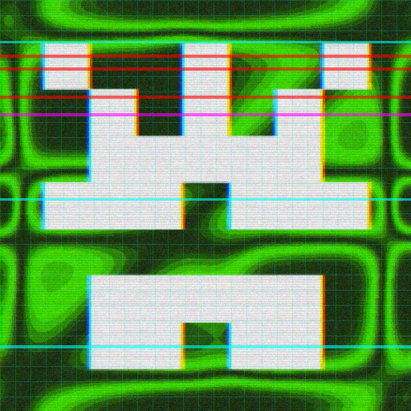</a> | <a href="repostuff/genbackico/delulu_without_effects/c69e7.png" target="_blank"></a> | <a href="repostuff/genbackico/backgrounds/delulu/c69e7.png" target="_blank">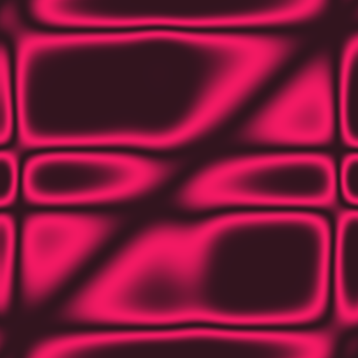</a> |

| Combined (distorted)                                                                                                                    | Combined (No effects)                                                                                                                                                   | Background                                                                                                                                                      |
| --------------------------------------------------------------------------------------------------------------------------------------- | ----------------------------------------------------------------------------------------------------------------------------------------------------------------------- | --------------------------------------------------------------------------------------------------------------------------------------------------------------- |
| <a href="repostuff/genbackico/distorted/c69e7.png" target="_blank">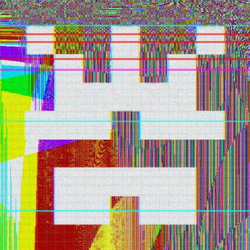</a> | <a href="repostuff/genbackico/distorted_without_effects/c69e7.png" target="_blank">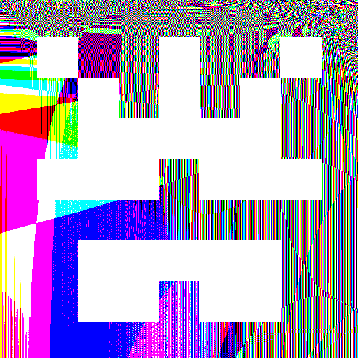</a> | <a href="repostuff/genbackico/backgrounds/distorted/c69e7.png" target="_blank">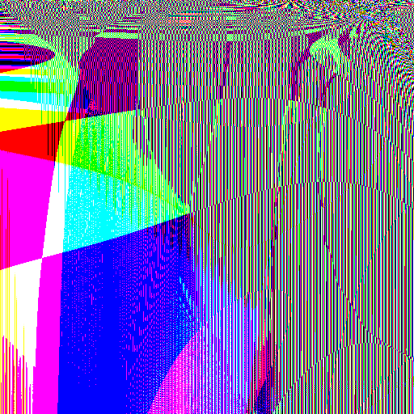</a> |

#### Full seed: 2dc42bc3ede4265f41d863dece5118e1a82e5c8c69dedf9630

| Combined (delusional)                                                                                                             | Combined (No effects)                                                                                                                                             | Background                                                                                                                                                |
| --------------------------------------------------------------------------------------------------------------------------------- | ----------------------------------------------------------------------------------------------------------------------------------------------------------------- | --------------------------------------------------------------------------------------------------------------------------------------------------------- |
| <a href="repostuff/genbackico/delulu/2dc42.png" target="_blank">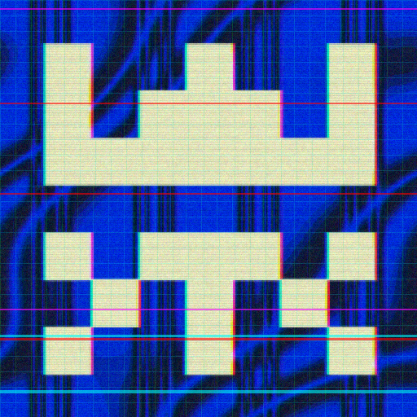</a> | <a href="repostuff/genbackico/delulu_without_effects/2dc42.png" target="_blank">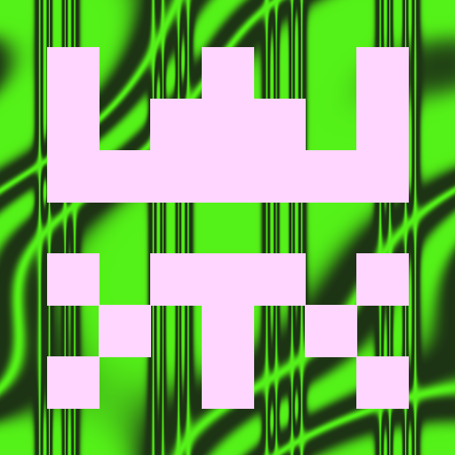</a> | <a href="repostuff/genbackico/backgrounds/delulu/2dc42.png" target="_blank"></a> |

| Combined (distorted)                                                                                                                    | Combined (No effects)                                                                                                                                                   | Background                                                                                                                                                      |
| --------------------------------------------------------------------------------------------------------------------------------------- | ----------------------------------------------------------------------------------------------------------------------------------------------------------------------- | --------------------------------------------------------------------------------------------------------------------------------------------------------------- |
| <a href="repostuff/genbackico/distorted/2dc42.png" target="_blank">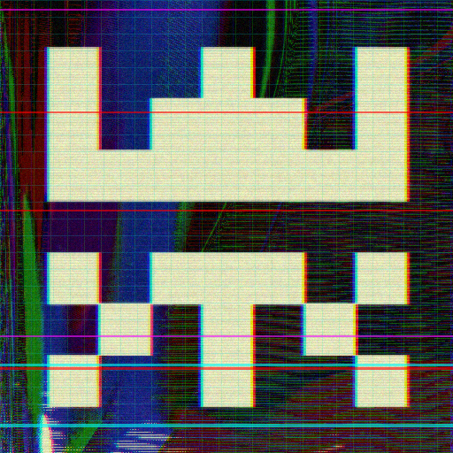</a> | <a href="repostuff/genbackico/distorted_without_effects/2dc42.png" target="_blank">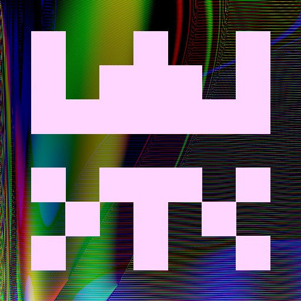</a> | <a href="repostuff/genbackico/backgrounds/distorted/2dc42.png" target="_blank">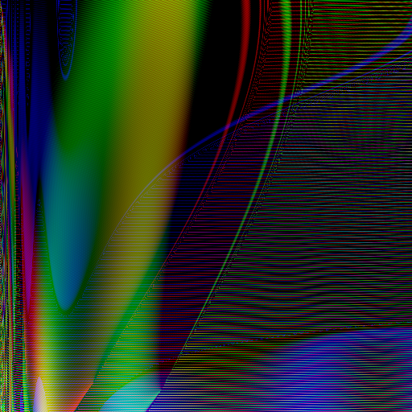</a> |

<details>
<summary><b>More examples</b></summary>

#### Full seed: 0b37b430e0b00142cbfdd818d0e9562d9d347544079040b804

| Combined (delusional)                                                                                                             | Combined (No effects)                                                                                                                                             | Background                                                                                                                                                |
| --------------------------------------------------------------------------------------------------------------------------------- | ----------------------------------------------------------------------------------------------------------------------------------------------------------------- | --------------------------------------------------------------------------------------------------------------------------------------------------------- |
| <a href="repostuff/genbackico/delulu/0b37b.png" target="_blank">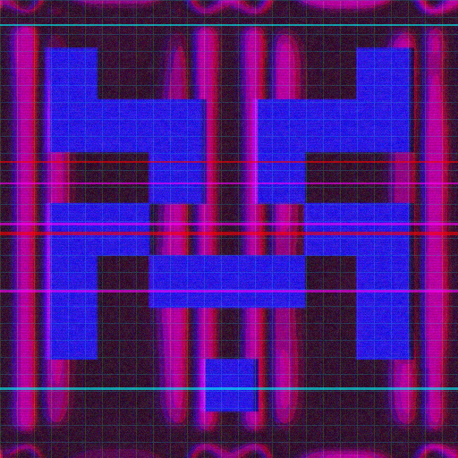</a> | <a href="repostuff/genbackico/delulu_without_effects/0b37b.png" target="_blank"></a> | <a href="repostuff/genbackico/backgrounds/delulu/0b37b.png" target="_blank">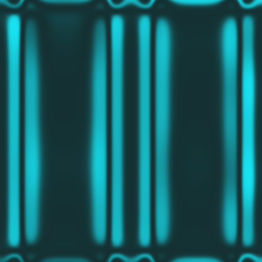</a> |

| Combined (distorted)                                                                                                                    | Combined (No effects)                                                                                                                                                   | Background                                                                                                                                                      |
| --------------------------------------------------------------------------------------------------------------------------------------- | ----------------------------------------------------------------------------------------------------------------------------------------------------------------------- | --------------------------------------------------------------------------------------------------------------------------------------------------------------- |
| <a href="repostuff/genbackico/distorted/0b37b.png" target="_blank">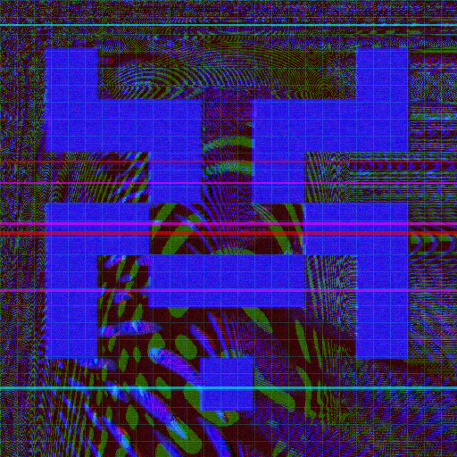</a> | <a href="repostuff/genbackico/distorted_without_effects/0b37b.png" target="_blank">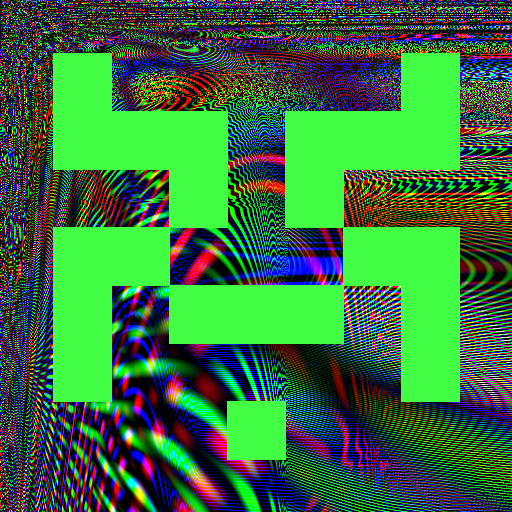</a> | <a href="repostuff/genbackico/backgrounds/distorted/0b37b.png" target="_blank">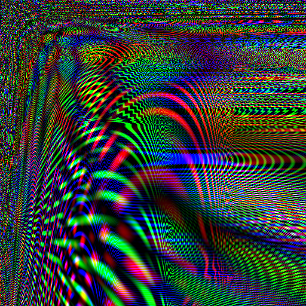</a> |

#### Full seed: 600bd30349a981b924a07568e3bcd8e36a141dd048062f36e9

| Combined (delusional)                                                                                                             | Combined (No effects)                                                                                                                                             | Background                                                                                                                                                |
| --------------------------------------------------------------------------------------------------------------------------------- | ----------------------------------------------------------------------------------------------------------------------------------------------------------------- | --------------------------------------------------------------------------------------------------------------------------------------------------------- |
| <a href="repostuff/genbackico/delulu/600bd.png" target="_blank">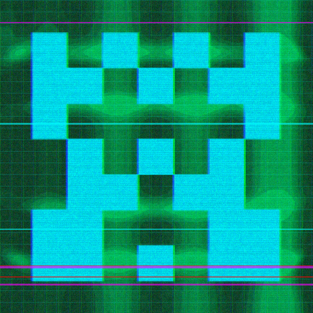</a> | <a href="repostuff/genbackico/delulu_without_effects/600bd.png" target="_blank"></a> | <a href="repostuff/genbackico/backgrounds/delulu/600bd.png" target="_blank"></a> |

| Combined (distorted)                                                                                                                    | Combined (No effects)                                                                                                                                                   | Background                                                                                                                                                      |
| --------------------------------------------------------------------------------------------------------------------------------------- | ----------------------------------------------------------------------------------------------------------------------------------------------------------------------- | --------------------------------------------------------------------------------------------------------------------------------------------------------------- |
| <a href="repostuff/genbackico/distorted/600bd.png" target="_blank">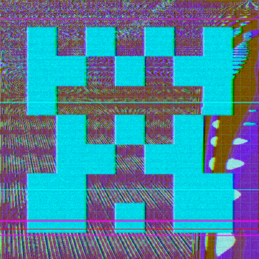</a> | <a href="repostuff/genbackico/distorted_without_effects/600bd.png" target="_blank">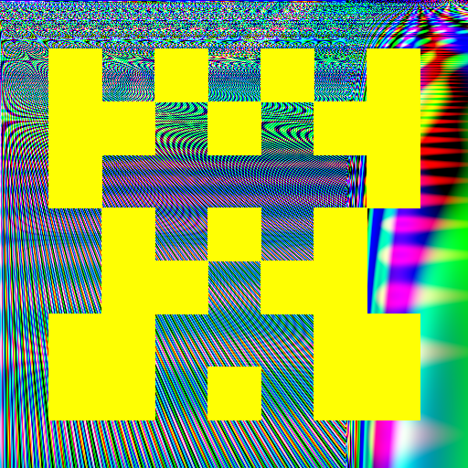</a> | <a href="repostuff/genbackico/backgrounds/distorted/600bd.png" target="_blank">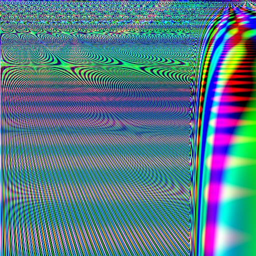</a> |

#### Full seed: 9811657cd6ebbfdf1f862df437538a5c2c873b23badfe9a177

| Combined (delusional)                                                                                                             | Combined (No effects)                                                                                                                                             | Background                                                                                                                                                |
| --------------------------------------------------------------------------------------------------------------------------------- | ----------------------------------------------------------------------------------------------------------------------------------------------------------------- | --------------------------------------------------------------------------------------------------------------------------------------------------------- |
| <a href="repostuff/genbackico/delulu/98116.png" target="_blank">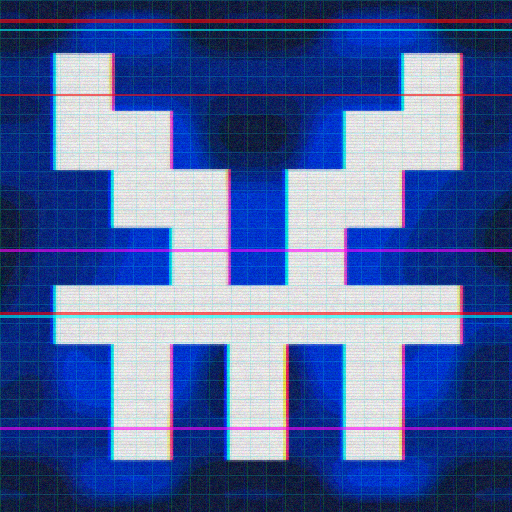</a> | <a href="repostuff/genbackico/delulu_without_effects/98116.png" target="_blank"></a> | <a href="repostuff/genbackico/backgrounds/delulu/98116.png" target="_blank"></a> |

| Combined (distorted)                                                                                                                    | Combined (No effects)                                                                                                                                                   | Background                                                                                                                                                      |
| --------------------------------------------------------------------------------------------------------------------------------------- | ----------------------------------------------------------------------------------------------------------------------------------------------------------------------- | --------------------------------------------------------------------------------------------------------------------------------------------------------------- |
| <a href="repostuff/genbackico/distorted/98116.png" target="_blank">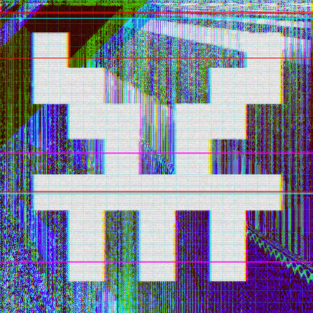</a> | <a href="repostuff/genbackico/distorted_without_effects/98116.png" target="_blank">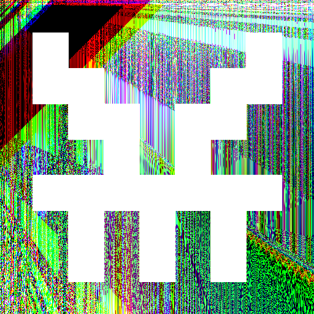</a> | <a href="repostuff/genbackico/backgrounds/distorted/98116.png" target="_blank">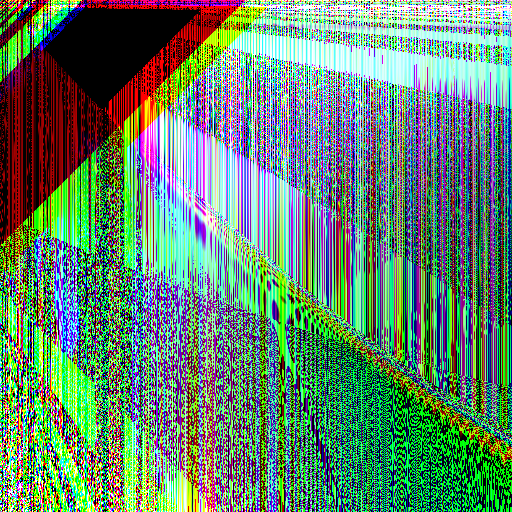</a> |

#### Full seed: d8a4eff74fa978a5eb0aa44ecc66f4533950dc35178ad9e0de

| Combined (delusional)                                                                                                             | Combined (No effects)                                                                                                                                             | Background                                                                                                                                                |
| --------------------------------------------------------------------------------------------------------------------------------- | ----------------------------------------------------------------------------------------------------------------------------------------------------------------- | --------------------------------------------------------------------------------------------------------------------------------------------------------- |
| <a href="repostuff/genbackico/delulu/d8a4e.png" target="_blank">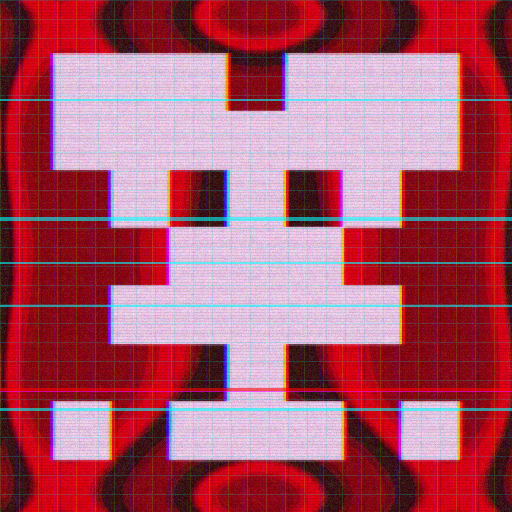</a> | <a href="repostuff/genbackico/delulu_without_effects/d8a4e.png" target="_blank">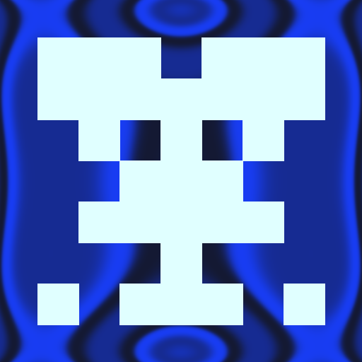</a> | <a href="repostuff/genbackico/backgrounds/delulu/d8a4e.png" target="_blank">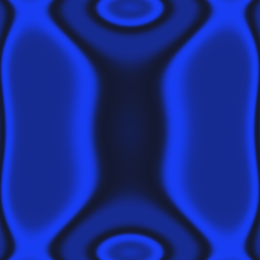</a> |

| Combined (distorted)                                                                                                                    | Combined (No effects)                                                                                                                                                   | Background                                                                                                                                                      |
| --------------------------------------------------------------------------------------------------------------------------------------- | ----------------------------------------------------------------------------------------------------------------------------------------------------------------------- | --------------------------------------------------------------------------------------------------------------------------------------------------------------- |
| <a href="repostuff/genbackico/distorted/d8a4e.png" target="_blank">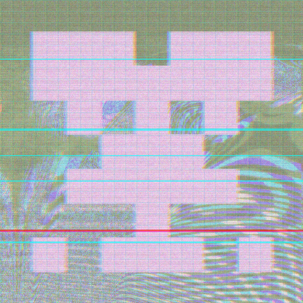</a> | <a href="repostuff/genbackico/distorted_without_effects/d8a4e.png" target="_blank">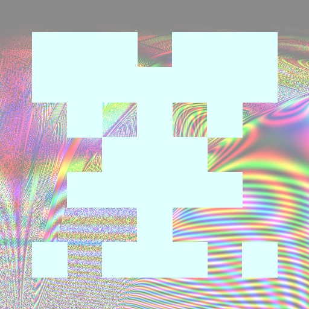</a> | <a href="repostuff/genbackico/backgrounds/distorted/d8a4e.png" target="_blank">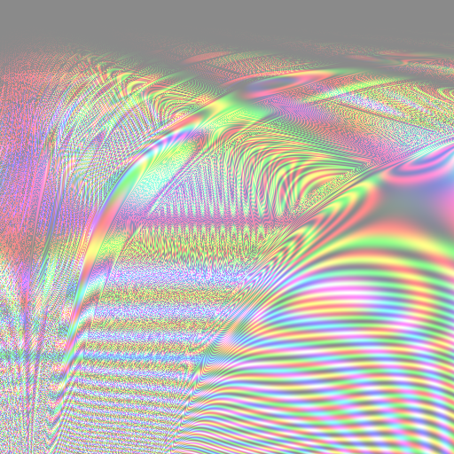</a> |

#### Full seed: 6df6e8ea26e1f7396160d9fa01a63ddb64c96b18f71efce3b8

| Combined (delusional)                                                                                                             | Combined (No effects)                                                                                                                                             | Background                                                                                                                                                |
| --------------------------------------------------------------------------------------------------------------------------------- | ----------------------------------------------------------------------------------------------------------------------------------------------------------------- | --------------------------------------------------------------------------------------------------------------------------------------------------------- |
| <a href="repostuff/genbackico/delulu/6df6e.png" target="_blank">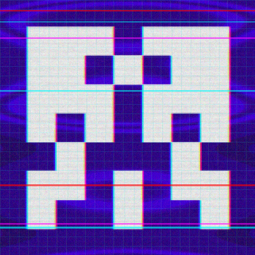</a> | <a href="repostuff/genbackico/delulu_without_effects/6df6e.png" target="_blank"></a> | <a href="repostuff/genbackico/backgrounds/delulu/6df6e.png" target="_blank"></a> |

| Combined (distorted)                                                                                                                    | Combined (No effects)                                                                                                                                                   | Background                                                                                                                                                      |
| --------------------------------------------------------------------------------------------------------------------------------------- | ----------------------------------------------------------------------------------------------------------------------------------------------------------------------- | --------------------------------------------------------------------------------------------------------------------------------------------------------------- |
| <a href="repostuff/genbackico/distorted/6df6e.png" target="_blank">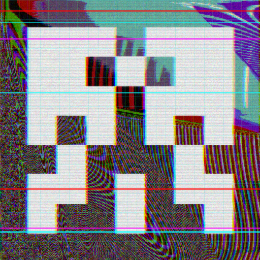</a> | <a href="repostuff/genbackico/distorted_without_effects/6df6e.png" target="_blank">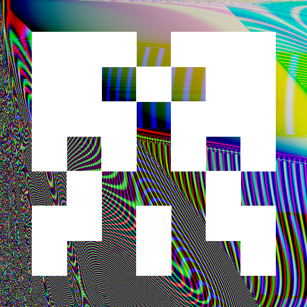</a> | <a href="repostuff/genbackico/backgrounds/distorted/6df6e.png" target="_blank">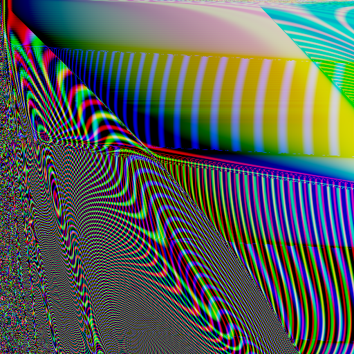</a> |

#### Full seed: 9cb376dace89ba8e4e23cd34b769e93abc18ef2a82822e8ddc

| Combined (delusional)                                                                                                             | Combined (No effects)                                                                                                                                             | Background                                                                                                                                                |
| --------------------------------------------------------------------------------------------------------------------------------- | ----------------------------------------------------------------------------------------------------------------------------------------------------------------- | --------------------------------------------------------------------------------------------------------------------------------------------------------- |
| <a href="repostuff/genbackico/delulu/9cb37.png" target="_blank">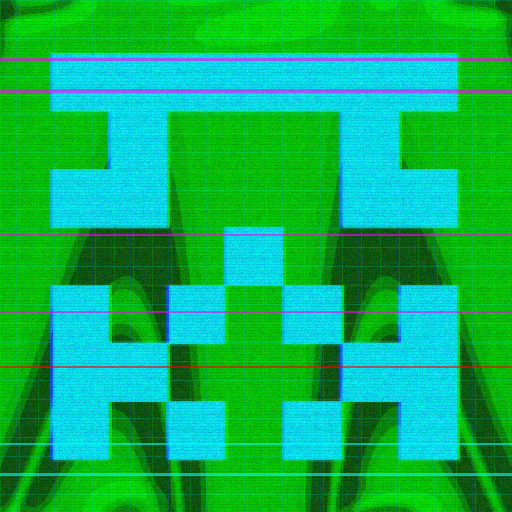</a> | <a href="repostuff/genbackico/delulu_without_effects/9cb37.png" target="_blank"></a> | <a href="repostuff/genbackico/backgrounds/delulu/9cb37.png" target="_blank">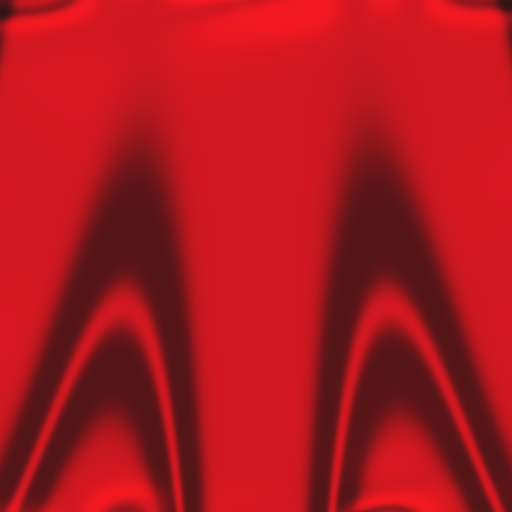</a> |

| Combined (distorted)                                                                                                                    | Combined (No effects)                                                                                                                                                   | Background                                                                                                                                                      |
| --------------------------------------------------------------------------------------------------------------------------------------- | ----------------------------------------------------------------------------------------------------------------------------------------------------------------------- | --------------------------------------------------------------------------------------------------------------------------------------------------------------- |
| <a href="repostuff/genbackico/distorted/9cb37.png" target="_blank">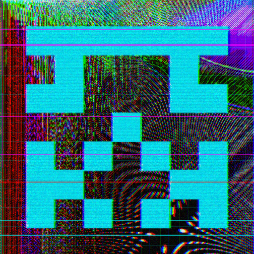</a> | <a href="repostuff/genbackico/distorted_without_effects/9cb37.png" target="_blank">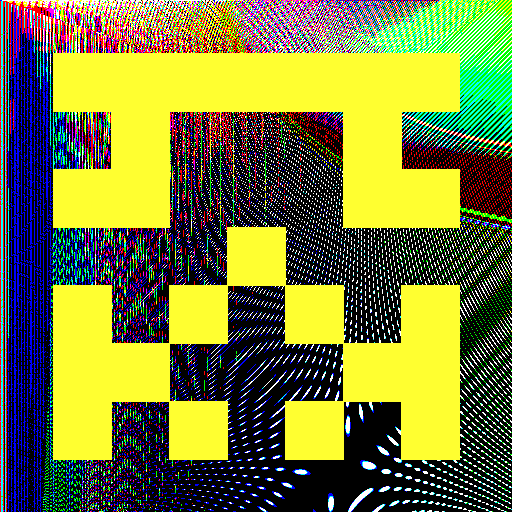</a> | <a href="repostuff/genbackico/backgrounds/distorted/9cb37.png" target="_blank">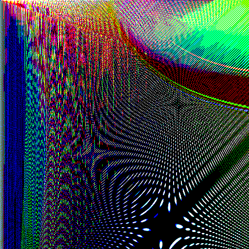</a> |

#### Full seed: d4bbe906621b3c41be15988878270c10d78a4d3167bee36a9c

| Combined (delusional)                                                                                                             | Combined (No effects)                                                                                                                                             | Background                                                                                                                                                |
| --------------------------------------------------------------------------------------------------------------------------------- | ----------------------------------------------------------------------------------------------------------------------------------------------------------------- | --------------------------------------------------------------------------------------------------------------------------------------------------------- |
| <a href="repostuff/genbackico/delulu/d4bbe.png" target="_blank">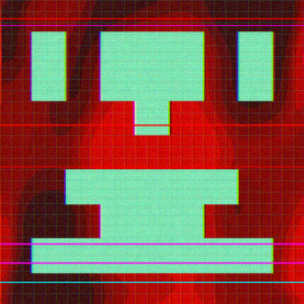</a> | <a href="repostuff/genbackico/delulu_without_effects/d4bbe.png" target="_blank">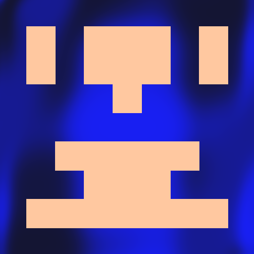</a> | <a href="repostuff/genbackico/backgrounds/delulu/d4bbe.png" target="_blank"></a> |

| Combined (distorted)                                                                                                                    | Combined (No effects)                                                                                                                                                   | Background                                                                                                                                                      |
| --------------------------------------------------------------------------------------------------------------------------------------- | ----------------------------------------------------------------------------------------------------------------------------------------------------------------------- | --------------------------------------------------------------------------------------------------------------------------------------------------------------- |
| <a href="repostuff/genbackico/distorted/d4bbe.png" target="_blank">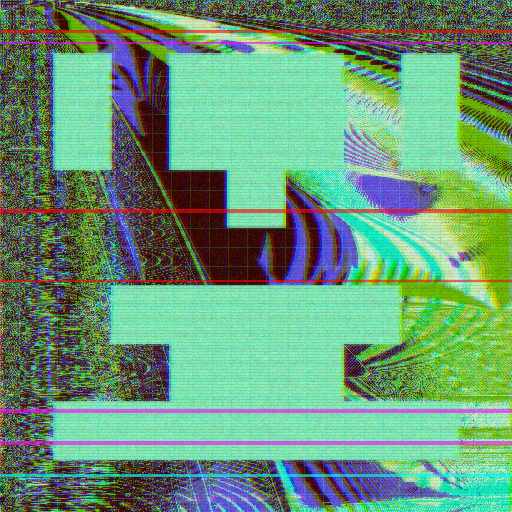</a> | <a href="repostuff/genbackico/distorted_without_effects/d4bbe.png" target="_blank">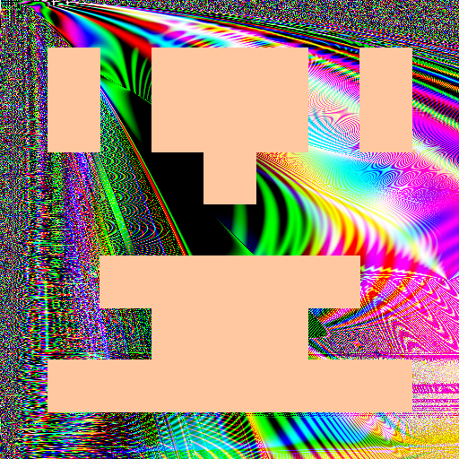</a> | <a href="repostuff/genbackico/backgrounds/distorted/d4bbe.png" target="_blank">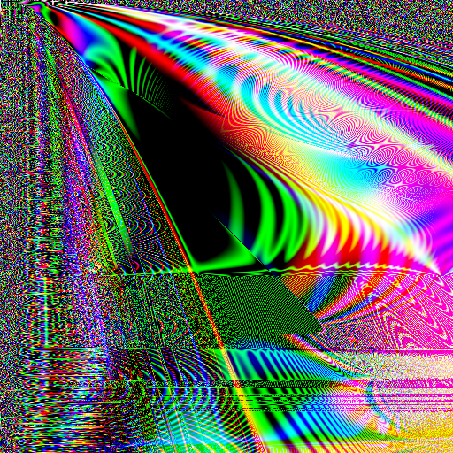</a> |

#### Full seed: e22b2f16daa35354b47b72b3460b918f91ded5dd7ee2430ffd

| Combined (delusional)                                                                                                             | Combined (No effects)                                                                                                                                             | Background                                                                                                                                                |
| --------------------------------------------------------------------------------------------------------------------------------- | ----------------------------------------------------------------------------------------------------------------------------------------------------------------- | --------------------------------------------------------------------------------------------------------------------------------------------------------- |
| <a href="repostuff/genbackico/delulu/e22b2.png" target="_blank">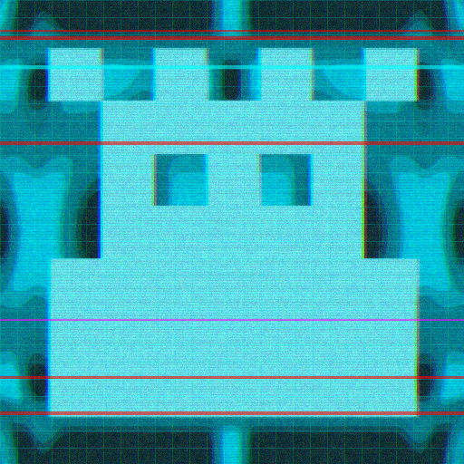</a> | <a href="repostuff/genbackico/delulu_without_effects/e22b2.png" target="_blank"></a> | <a href="repostuff/genbackico/backgrounds/delulu/e22b2.png" target="_blank">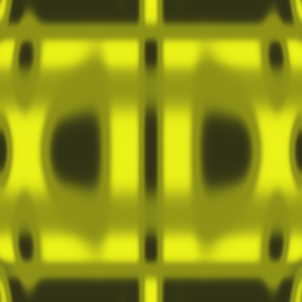</a> |

| Combined (distorted)                                                                                                                    | Combined (No effects)                                                                                                                                                   | Background                                                                                                                                                      |
| --------------------------------------------------------------------------------------------------------------------------------------- | ----------------------------------------------------------------------------------------------------------------------------------------------------------------------- | --------------------------------------------------------------------------------------------------------------------------------------------------------------- |
| <a href="repostuff/genbackico/distorted/e22b2.png" target="_blank">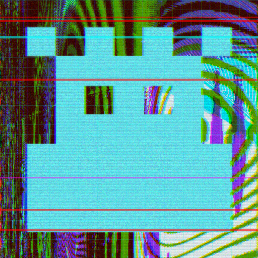</a> | <a href="repostuff/genbackico/distorted_without_effects/e22b2.png" target="_blank">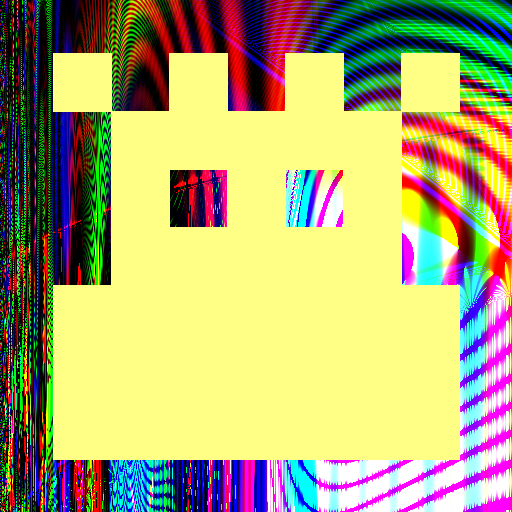</a> | <a href="repostuff/genbackico/backgrounds/distorted/e22b2.png" target="_blank">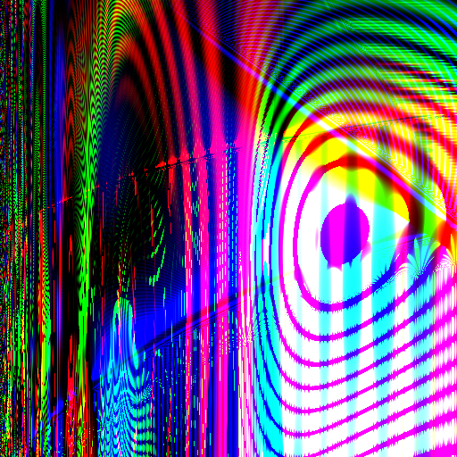</a> |

</details>
</div>

### API Endpoints

#### User & Auth

<details>
   <summary><b>Username availability</b></summary>
<br>

`POST /a/user`

Request headers:

```
username: $USERNAME
```

Response headers:

Available

```
HTTP/1.1 200 OK
```

Not available

```
HTTP/1.1 302 Found
```

</details>

<details>
   <summary><b>Registering a new account</b></summary>
<br>

`POST /a/register`

Request headers:

```
content-type: application/json;
```

Request body:

```
{
  "username": "String"
}
```

Response headers:

```
HTTP/1.1 200 OK
content-type: application/json;
set-cookie: jwt=TOKEN; HttpOnly; Path=/; SameSite=lax;
```

Response body:

```
{
  "matrix_id":"0x1",
  "matrix_key":"XXXXX-XXXXX-XXXXX-XXXXX"
}
```

**Wrong username format:**

Response headers:

```
HTTP/1.1 400 Bad Request
```

Response body:

```
Username cannot contain spaces and/or symbols.
```

**Not available username:**

Response headers:

```
HTTP/1.1 400 Bad Request
content-type: text/plain
```

Response body:

```
Username is already taken.
```

**Internal error:**

Response headers:

```
HTTP/1.1 422 Unprocessable Content
content-type: text/plain
```

Response body:

```
Couldn't handle this request.
```

</details>
<details>
    <summary><b>Logging in</b></summary>
<br>

`POST /a/login`

Request headers:

```
content-type: application/json;
```

Request body:

```
{
  "matrix_id": "String",
  "matrix_key": "String"
}
```

Response headers:

```
HTTP/1.1 200 OK
content-type: application/json;
set-cookie: jwt=TOKEN; HttpOnly; Path=/; SameSite=lax
```

Response body:

```
{
  "matrix_id": "String"
}
```

**Invalid credentials:**

Response headers:

```
HTTP/1.1 401 Unauthorized
content-type: text/plain

```

Response body:

```
invalid credentials
```

</details>
<details>
    <summary><b>Logging out</b></summary>
<br>

`GET /a/logout`

Response header:

```
HTTP/1.1 200 OK
set-cookie: jwt=""; expires=$DATE GMT; Max-Age=0; Path=/; SameSite=lax
```

Response body:

```
{
  "logged_out": boolean
}
```

> If the client provided a valid cookie inside the request headers, it'll be removed from the server. And the response will include `"logged_out": true`, however, in case it wasn't a valid cookie it'll reply with false. Either ways the client cookie will be removed from their end.

</details>
<details>
     <summary><b>Check session cookie</b></summary>
<br>

`POST /a/user`

Request headers:

```
check: true
cookie: jwt=TOKEN;
```

**Logged in**:

Response headers:

```
HTTP/1.1 200 OK
content-type: application/json;
```

Response body:

```
{
  "matrix_id":"String"
}
```

**Logged out**:
Response headers:

```
HTTP/1.1 401 Unauthorized
```

</details>

<details>
     <summary><b>Edit user profile [Auth required]</b></summary>
<br>

`POST /a/edit_profile`

Request headers:

```
content-type: application/json;
cookie: jwt=TOKEN;
```

Request body:

```
{
  "pfp": "$MEDIA_ID",
  "matrix_pfp": {
    "gen_type": "temp",
    "seed": "",
    "type": "combined", // ["identicon","background","combined"]
    "bk_type": "delusional", // ["delusional","distorted"]
    "pixelated_effect": boolean,
    "cyber_effect": boolean,
    "early_internet_effect": boolean
  },
  "use_matrix_pfp": boolean,
  "reset_pfp": boolean,
  "ig": "String",
  "tg": "String",
  "dc": "String"
}
```

**Invalid `pfp`,`ig`,`tg`,`dc`:**

Response headers:

```
HTTP/1.1 422 Unprocessable Content
```

**Invalid `matrix_pfp` dict:**

Response headers:

```
HTTP/1.1 422 Unprocessable Content
```

Invalid `matrix_pfp.type or matrix_pfp.bk_type`:

Response headers:

```
HTTP/1.1 400 Bad Request
content-type: text/plain
```

Response body:

```
You can only choose from [identicon, background, combined] for the image type, and from [delusional, distorted] for the background type.
```

**Invalid session**

Response headers:

```
HTTP/1.1 401 Unauthorized
```

**insufficient permission for the $MEDIA_ID, Account Or the add media isn't a pfp:**

Response headers:

```
HTTP/1.1 401 Unauthorized
```

Details:

Adding `matrix_pfp` with setting `use_matrix_pfp` to true, would result on the user profile picture to be changed with a newly generated picture.

Leaving `pfp` and `use_matrix_pfp` empty or not including them, would make no changes to the user profile picture

Adding `pfp:"$MEDIA_ID"` would result on changing the user profile picture to the provided $MEDIA_ID if its found on the DB while the owner is the same as who made this request.

Setting `reset_pfp` to true, would change the current user profile picture to the one they had at registering.

`ig`, `dc` and `tg` are the user socials, leaving them empty would result on them being deleted.

</details>

#### Media

<details>
     <summary><b>Checking media availability</b></summary>
<br>

`GET /a/media_hash_query`

Parameters:

`hash` = String // SHA256-HASH

**Available:**

Response headers:

```
HTTP/1.1 200 OK
```

**Not available:**

Response headers:

```
HTTP/1.1 302 Found
```

</details>

<details>
     <summary><b>Getting a media file stream</b></summary>
<br>

`GET /a/media`

Parameters:

`id` = String // $MEDIA_ID

Response headers:

```
HTTP/1.1 200 OK
content-type: MIME-TYPE
transfer-encoding: chunked
```

Response body: Binary

> Would require the owner cookie if this media wasn't posted yet.

**$MEDIA_ID Isn't available:**

Response headers:

```
HTTP/1.1 404 Not Found
```

> If deleted, would return `404`
>
> If the server couldn't handle this media file, will return `500`

</details>

<details>
     <summary><b>Uploading media [Auth required]</b></summary>
<br>

`POST /a/media_upload`

Request headers:

```
content-type: multipart/form-data; boundary=WEBKIT-FORM-BOUNDARY;
cookie: jwt=TOKEN;
```

Request body type: `multipart/form-data`

Fields:

```
file: Binary // ["mp4","mp3","jpeg","png","gif"]
is_pfp_str: String // ["true","false"]
```

Response headers:

```
HTTP/1.1 200 OK
content-type: application/json;
```

Response body:

```
{
  "media_id": $MEDIA_ID
}
```

**Invalid file format, Empty request:**

Response headers:

```
HTTP/1.1 422 Unprocessable Content
content-type: text/plain
```

Response body:

```
Cannot accept this file-type.
```

**Max file-size exceeded:**

Response headers:

```
HTTP/1.1 413 Content Too Large
content-type: text/plain
```

Response body:

```
Media file cannot exceed: $SERVER-MAX-SIZE-IN-MB
```

**Duplicate upload:**

Response headers:

```
HTTP/1.1 302 Found
```

In case that file was uploaded from the same user who sent this request but they haven't post it yet, they'll get an OK response with their media_id.

</details>

#### Posts

<details>
     <summary><b>Post [Auth required]</b></summary>
<br>

`POST /a/post`

Request headers:

```
content-type: application/json;
cookie: jwt=TOKEN;
```

Request body:

```
{
  "title":"String",
  "desc":"String", // Description
  "media_id":"$MEDIA_ID"
}
```

Response headers:

```
HTTP/1.1 200 OK
content-type: application/json;
```

Response body:

```
{
  "post_id":"$POST_ID"
}
```

**Empty title, Not the media owner or This media entry have the `is_pfp_str` field set to true:**

Response headers:

```
HTTP/1.1 400 Bad Request
```

</details>

<details>
     <summary><b>User posts feed</b></summary>
<br>

`GET /a/posts`

Parameters:

`cursor` = String

Response body:

```
{
  "posts":[ // Posts list
    {
      "post_id": "String",
      "title": "String",
      "type": "String",
      "media_id": "String",
      "theme": null
    }
          ],
  next_cursor: "String"
}
```

</details>

<details>
     <summary><b>Get a specific post</b></summary>
<br>

`GET /a/post`

Parameters:
`id` = String // Post id

`metadata` = boolean // [false, true]

`delete` = boolean // [false, true] [Auth required]

Response headers:

```
HTTP/1.1 200 OK
content-type: application/json;
```

Response body:

```
{
  "title": "String",
  "disc": "String", // Description
  "matrix_id": "String", // Owner id
  "date_unix": Integer,
  "post_id": "String",
  "theme": null,
  "type": "String",
  "media_id": "String",
  "owner": {
      "username": "String",
      "matrix_id": "String",
      "pfp": "String",
      "ig": "String",
      "tg": "String",
      "dc": "String"
  },
  "metadata": { // For showing the metadata json inside of the post page
      "post_id": "String",
      "owner_id": "String",
      "date": "String",
      "media": {
          "id": "String",
          "owner_id": "String",
          "original_name": "String",
          "upload_date": "String",
          "size": "String",
          "mime": "String",
          "sha256": "String"
      }
  }
}
```

**Post not found:**

Response header:

```
HTTP/1.1 404 Not Found
```

**delete=true:**

> Would return the normal post response if the request doesn't have the post owner cookie

Request headers:

```
cookie: jwt=TOKEN;
```

Response header:

```
HTTP/1.1 200 OK
```

</details>

#### Misc

<details>
     <summary><b>Generate Rematrix picture [Require auth by default]</b></summary>
<br>

`GET a/gen_rematrix_picture`

Parameters:

`gen_type` = String // "temp"

`seed` = String // 100 characters max, default = random

`type` = String // [identicon, background, combined], default = combined

`bk_type` = String // [delusional, distorted], default = delusional

`pixelated_effect` = boolean // Default = false

`cyber_effect` = boolean // Default = false

`early_internet_effect` = boolean // Default = false

Response headers:

```
HTTP/1.1 200 OK
content-type: image/webp
seed: String // The generated image seed, the same if it was set while sending the request. Else it'll be randomly generated.
transfer-encoding: chunked
```

Response body: Binary

**On invalid `seed`, `bk_type`, `gen_type`, `type` formats:**:
Response headers:

```
HTTP/1.1 422 Unprocessable Content
```

**On invalid `type` or `bk_type`:**
Response headers:

```
HTTP/1.1 400 Bad Request
content-type: text/plain
```

Response body:

```
You can only choose from [identicon, background, combined] for the image type, and from [delusional, distorted] for the background type.
```

> On internal error, the server will return `400`

</details>

<details>
     <summary><b>Check connection</b></summary>
<br>

`GET /a/check_connection`

Response headers:

```
HTTP/1.1 200 OK
```

> Well, obviously. If there's no connection, the client would have an error.

</details>

## Frontend

Using a sprite maker I designed a 36x36 png with some lines I used to create a neat crt-ish effect to put on top of the whole website.

While I was trying to get the best out of it, I ended up putting some blur under these lines. It was kinda hard to find a balance where your eyes don’t hurt, but the effect is still visible and gives the intended vibe.

In total, everything came together with the most important piece to finish the whole design which are these corners

<div align="center">
		<a href="repostuff/assets/elements/button-normal.gif" target="_blank">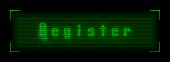</a>
</div>

Adding a flicker effect on the inside text was the last piece I was hoping for to complete the visual hook

In total, there are four different variants of this button. And I used all of them to give different feedback for each state.

<div align="center">

| Normal                                                                                                                            | Error / Cancel                                                                                                                  | On progress                                                                                                                                 | Accent                                                                                                                            |
| --------------------------------------------------------------------------------------------------------------------------------- | ------------------------------------------------------------------------------------------------------------------------------- | ------------------------------------------------------------------------------------------------------------------------------------------- | --------------------------------------------------------------------------------------------------------------------------------- |
| <a href="repostuff/assets/elements/button-normal.gif" target="_blank"></a> | <a href="repostuff/assets/elements/button-error.gif" target="_blank">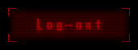</a> | <a href="repostuff/assets/elements/button-on_progress.gif" target="_blank">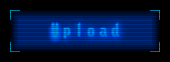</a> | <a href="repostuff/assets/elements/button-accent.gif" target="_blank"></a> |

</div>

Switching between them shouldn't take any longer than just swapping an html attribute

```
on_progress
error
accent
hidden
no_animated_corner
```

The hardest part, though, was building a lightweight mansory view for the feed. I first tried using `column-count` to limit the feed to 2 columns while preserving each element’s height. But that didn’t work as well as I expected.

It kept refreshing the whole dom and messing up the layout whenever a post was added or loaded while scrolling. So I ended up building the mansory logic in JS, controlling how each element behaves when it loads or gets added.

Vanilla Js isn't that bad to be honest, but it was, for sure, the most time consuming part of this whole project, lacking any kind of helpers and even fighting the IDE to get proper suggestions wasn't fun. But after reaching half the timeline I wasn't bothered with how funky that thing was. I mean I was always imagining a discord mod adding new functions to this thing while trying to leave the old ones untouched. Just a sweaty experience, what do you mean you added a clipboard api yet you won't let me use it without https? what is really the difference between http and https when it comes to malware? exactly nothing.

And the worst part, it doesn't even tell you anything. Just `undefined` or a completely random error with no pointer to where it happened.

Apart from that, it wasn't any difference between any other kind of programming language. As long as you use it, you get better at it. Simple.

And it's not that different really, all of the things you might think of having you'll reach either by the browser API or Js built in functions.

Js wasn't the only thing I was fighting though, CSS and HTML wasn't any difference, both try to hold on their oldest fundamentals while adding new stuff. using newer properties feels completely different from using older ones, and the endless amount of hidden goods with the `-webkit` prefix is just confusing.

## Media Player Visualizer

<div align="center">
<a href="repostuff/assets/elements/media-player.gif" target="_blank">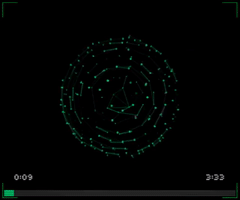</a>

</div>

A separated audio visualizer that runs inside an `iframe`.

Though, it has pretty heavy animation and isolating it inside an iframe only makes it worse. It doesn't have any problem running videos though, just the music.

It struggles on old phones and if I was lucky enough I was getting around 40 fps if there was more than one media player per page, ended up limiting the framerate for idle players to have somewhat decent framerate on the feed page. But still needs a lot of optimization.

The first revisions were too heavy though, since the starting particles count was higher than 500 particle. The whole thing is drawing the canvas with each frame. while measuring the audio intensity, and editing each particle state while adding random glitchy lines.

## Quick start

### Pi zero 2w - Captive Portal:

Download the latest `rematrix-gallery-rpi-02w.img.gz` from [here](https://github.com/remohexa/rematrix-gallery/releases). Once you have the file, you'll need write it to your SD card.

You can achieve this by any standard method you would like to use, but for general steps

1. Download [Balena Etcher](https://etcher.balena.io/) or [Raspberry Pi Imager](https://www.raspberrypi.com/software/).
2. Install and open the program you decided to go with.
3. Connect your SD card and select the `.img.gz` file you just downloaded.
4. Select your SD card. Then click `Flash`.

Once it finishes flashing, disconnect your SD card and put it inside your Pi then power it up. Make sure you gave it a proper power source or else it'll bootloop whenever it boots.

Once it finishes booting you should find a new open wifi network called `Rematrix gallery` connecting to it should open your wifi sign up page which will show you the homepage of the website.

If, for any reason it just didn't. You either gonna find a notification called `Sign up` or simply open your browser and visit `http://192.168.2.1`.

> [!NOTE]
> Your Pi would reboot several times after the first boot, this is normal. And it wouldn't happen again once it finishes resizing your sdcard and making sure `Rematrix gallery` service works.

#### SSH access:

After connecting to the Pi hotspot, you can have an ssh access via `192.168.2.1`

```bash
ssh root@192.168.2.1
```

Default password is `alpine`, and there's only one user which is `root`.

You might want to disable the ssh access or change your root password.

For changing your root password run `passwd` after you ssh into it.

> [!WARNING]
> Disabling ssh means the only way to access your Pi system is through a mini HDMI cable and a keyboard connected via otg adapter. Make sure you have both before doing this.

Disabling ssh:

```sh
rc-update del sshd
```

> Unfortunately on my own I can only support `Raspberry pi zero 2W`, since that's the only SBC board I own.
>
> The images available in the releases tab is built on top of standard alpine rpi-armv7 image. Theoretically it should work with any Raspberry pi as far as I know.
>
> If it so happened that this image didn't boot or function as intended you can replicate the whole setup by following the [Captive Portal Mode](#captive-portal-mode) section.

### Standard LAN hosting:

#### Linux

Cloning into this repo:

```bash
git clone https://github.com/remohexa/rematrix-gallery.git
```

Going inside the repo dir and making a new python env:

```bash
cd rematrix-gallery
python3 -m venv rematrix_env
```

Using the new env and installing the requirements inside of it:

```bash
source rematrix_env/bin/activate
pip install -r requirements.txt
```

Running the server & serving the frontend at the same time:

Set Fastapi_Serving_captive_portal inside `utils/public_vars.py` to True and then run

```bash
sudo uvicorn rematrix_api:app --host 0.0.0.0 --port 80
```

This should start the server and wait for any requests coming to your local ip since we chose the default http port.

If you don't want to run this as root, you need to change the port to something between 1024 and 65535.

E.g.

```bash
sudo uvicorn rematrix_api:app --host 0.0.0.0 --port 5555
```

Knowing your local ip:

```bash
hostname -I
```

Then you should be able to visit

```
http://YOUR_IP
```

Or

```
http://YOUR_IP:PORT
```

If you changed the port to anything but `80`.

#### Windows

Download this repo source code or `git clone` into it

Unzip the archive if you downloaded the source code.

Open the source code main folder and write `cmd` on the current directory bar.

```
python -m venv rematrix_env

rematrix_env\Scripts\activate.bat

pip install -r requirements.txt
```

And then either run the server on port `80` or choose something higher so you won't need to run this as admin

```
uvicorn rematrix_api:app --host 0.0.0.0 --port 80
```

Non admin port:

```
uvicorn rematrix_api:app --host 0.0.0.0 --port 5555
```

Getting your local ip

from another cmd

```
ipconfig
```

And look for IPv4 Address

Then visit

```
http://YOUR_IP
```

Or

```
http://YOUR_IP:PORT
```

From any other device that are connected to your local network.

> [!NOTE]
> To use port `80` you'll need to open cmd as administrator

## Usage & Hosting

### Serving Configuration

The main config for serving is inside `utils/public_vars.py`

To change the current working directory where your database and uploaded media will live change `WORKING_DIRECTORY` to any other directory full path before the first run.

To disable or enable serving the front end, set `Fastapi_Serving_FrontEnd`
to `True` or `False`.

To enable the captive portal routes set `Fastapi_Serving_captive_portal` to `True`.

For allowing users to upload the same file that have been posted before set `Allow_duplicated_uploads` to `True` or `False`.

If your hardware is slightly underpowered and struggles while running this, you can set `Low_end_mode` to `True` which will cache all of the current uploaded media files on start and reduce the matrix picture generating quality.

However, for fine tuning you can change the whole generating properties under the `Matrix Picture Generation` comment.

For allowing users to generate pictures using the api without being logged in, set `Allow_no_auth_generation` to `True`.

### Captive Portal Mode

> [!NOTE]
> If the device you'll use to make this setup so happen to be a `Raspberry pi` you might want to take a look [**here**](#pi-zero-2w---captive-portal). Since I already included an img that you can just flash onto your sdcard instead of starting fresh.

> [!WARNING]
> In theory, this should work with any linux device. But again I just tested this using alpine inside a `Raspberry pi`.

#### For alpine systems:

Inside `/srv` copy this repo contents or simply clone into it from there.

Don't forget to set `Fastapi_Serving_captive_portal` to `True` inside `/srv/rematrix-gallery/utils/public_vars.py`, for fastapi to actually intercept and forward the captive portal requests.

And If you want fastapi to serve the front end as well, set `Fastapi_Serving_FrontEnd` to `True` inside the same file.

> You can always change that path to whatever you might like, I just choose a static path to simplify this process.

**Installing the required system packages:**

```sh
apk add dnsmasq hostapd uvicorn
```

For python packages you either can install them using pip or apk. I prefer using apk since I was dealing with armv7 and building stuff from wheels for that architecture was pure pain from my experience.

```sh
apk add py3-fastapi py3-pydantic py3-sqlalchemy py3-cryptography py3-pwdlib py3-python-jose py3-magic py3-numpy-dev py3-imageio py3-pillow py3-rich py3-python-multipart
```

Before adding the previous packages make sure that you added the testing and community repos to your apk repositories.

By adding the following to `/etc/apk/repositories`

```text
http://dl-cdn.alpinelinux.org/alpine/v3.23/community
http://dl-cdn.alpinelinux.org/alpine/edge/testing
# change `v3.23` to your alpine version
```

And then running

```sh
apk update
```

After making sure you have the right repos you can run that long `apk add py3-***` line to add all of the required python packages to your system.

In case you want to use `pip`. Run `pip -r requirements.txt` inside this project directory.

At this point you might want to check if your python setup is working.

Run

```
uvicorn rematrix_api:app --host 0.0.0.0 --port 80
```

And look for any errors, if nothing popped up you should be good to go. However in case you had an error, probably it's missing package, install it.

You might want to visit the website during that test as well, run `hostname -I` and visit that ip from any other device that are currently connected to the same network as your alpine system.

**Setting up the hotspot & dnsmasq:**

dnsmasq:

Change the following with the provided configs. You can change them as you like though:

`/etc/dnsmasq.conf`

```
interface=wlan0
dhcp-range=192.168.2.2,192.168.2.255,255.255.255.0,4h
address=/connectivitycheck.gstatic.com/192.168.2.1
address=/clients3.google.com/192.168.2.1
address=/captive.apple.com/192.168.2.1
address=/www.apple.com/192.168.2.1
address=/www.msftconnecttest.com/192.168.2.1
address=/www.msftncsi.com/192.168.2.1
```

`wlan0` is your wifi device name. Make sure it supports `ap` mode.

`dhcp-range` is which set of ip you want any device that connects to take an ip from. e.g.

from `192.168.2.2` to `192.168.2.20` means the maximum connections that your hotspot can handle is roughly 18 connections, and any connected device can only acquire an ip from that range. `192.168.2.2` always start from `2.2` since we always should give `2.1` to our device.

hostapd:

Copy `scripts/configs/hostapd.conf` from this repo to `/etc/hostapd/hostapd.conf`. It's a pretty long config ~2500 lines. And there's some important parts that have nothing to do with our hotspot itself.

At the beginning of the config that I provided you'll find these lines

```
interface=wlan0
ssid=Rematrix gallery
hw_mode=g
channel=6
wmm_enabled=0
auth_algs=1
ignore_broadcast_ssid=0
```

`ssid` is the hotspot name. And you may set `ignore_broadcast_ssid` to `1` if you want to hide the hotspot.

To add wpa2 protection to your hotspot though, add these lines:

```
wpa=2
wpa_passphrase=Your password goes here.
wpa_key_mgmt=WPA-PSK
rsn_pairwise=CCMP
```

Taking the very first ip on each boot:

Create `/etc/local.d/wlan0.start` and add the following inside

```
ip link set wlan0 up
ip addr add 192.168.2.1/24 dev wlan0
```

> If you changed your `dhcp-range` while we were setting up dnsmasq, you might need to change that `wlan0.start` script to match your settings.

**Making a service for Rematrix gallery. So it'll run on each boot:**

Inside `/etc/init.d/rematrix-gallery` copy the following:

```
#!/sbin/openrc-run

description="Rematrix-gallery Server"
name="rematrix-gallery"

command="uvicorn rematrix_api:app"
command_args="--host 0.0.0.0 --port 80"
directory="/srv/rematrix-gallery"
output_log="/srv/rematrix-gallery/logs/run.log"
error_log="/srv/rematrix-gallery/logs/errors.log"
command_background=true

pidfile="/run/${RC_SVCNAME}.pid"

depend() {
    after hostapd
}
```

**Finishing:**

At this point we need to just enable all of the previous services and make some stuff as executable scripts.

```sh
chmod +x /etc/local.d/wlan0.start
rc-update add rematrix-gallery default
rc-update add dnsmasq default
rc-update add hostapd default
rc-update add local default
```

Creating the missing logs directory inside the working directory:
```
mkdir /srv/rematrix-gallery/logs
```


And that's it! You should be good to go, just reboot your device and look if your hotspot popped up.

If not, check out `rc-status` and look if any service crashed. if none, make sure all of the previous process we just added are actually enabled and appearing when you run `rc-status`. If they doesn't appear, it's a pretty neat problem I faced. It's an `openrc` cache issue.

run the following and reboot your device, they should appear and start normally this time.

```
rm -rf /run/openrc
mkdir -p /run/openrc
touch /run/openrc/softlevel
reboot
```

You might want to check this [section](#serving-configuration) if you wanna fine tune your serving config.

### Lan Hosting

Just look inside this [section](#standard-lan-hosting).

## Known issues

- Wide screen support isn’t fully ready yet, but I’m working on it.

- The Android captive portal turned out to be pretty limited. While it does show the feed correctly and has no problem with the auth flow or generating pictures on the user page or during registration, it unfortunately doesn’t allow selecting a file on the upload page. I haven’t figured out how to handle that part yet.

- Android Firefox is causing issues with the flex layout in some parts of the website.

## Contributing

Fixing a typo, clarifying something in the readme, adding a whole new feature, or porting this to another device. All of which is genuinely welcomed.

And for sure, if anything broke while you're navigating any part of this. Make sure to open an issue.

## Credits & Licensing

### Credits

`Rematrix Gallery` is made by [@remohexa](https://remohexa.com). and is released under [GPLv3](LICENCE) license.

### Font licenses:

#### 04B_03\_\_.TFF sourced from: [04.jp.org](http://www.04.jp.org/)

#### Gaiatype.woff sourced from: [caveras.net](http://www.caveras.net)

#### StalinistOne-Regular.ttf sourced from: [Google Fonts](https://fonts.google.com/specimen/Stalinist+One)

#### guifx-v2-transports.ttf sourced from: unknown origin ([Licence](front/assets/fonts/licenses/guifx-v2-transports/license.txt))

> Full font license texts are available under `front/assets/fonts/licenses`


## P.S

This took a lot of time. Almost 3 weeks to just finish writing this readme. Ngl, the whole project was just tiring and insanely time consuming.

But I'm glad that this simple idea that popped into my mind almost 1.5y ago finally turned into reality.

I learned a lot through the whole process. Built it as a challenge to myself more than anything else, and I'm glad I did.

The usage of AI was pretty limited throughout the project. I never used it to write anything related to frontend, and only relied on it for some parts of the [deterministic picture generator](#deterministic-picture-generator) and the [media player visuals](#media-player-visualizer), mainly with the math parts.
